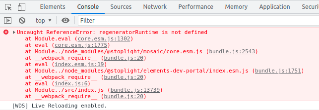

Install the packages
`yarn`

To start the app and see the logs
`yarn watch`

I'm trying to setup the custom webpack config and rendering the stoplight package but I'm having this error. In the case of `create-react-app` this package is working as expected.

Yarn version:
1.22.5

Node version:
12.13.0

Platform:
linux x64
